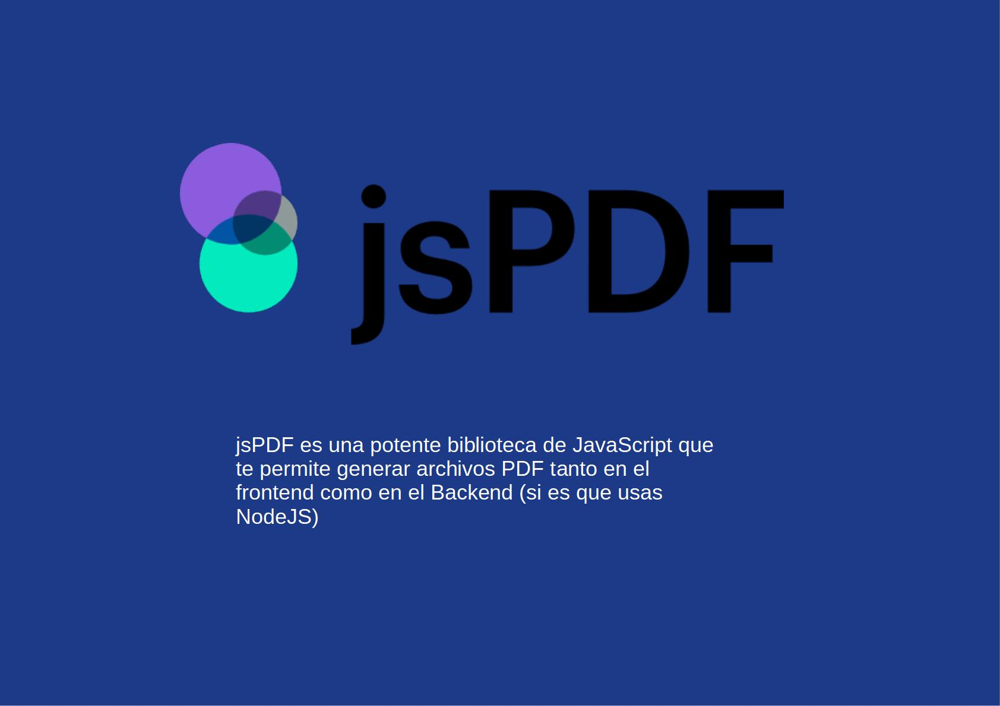
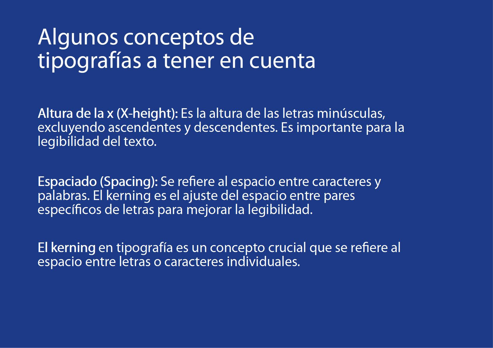
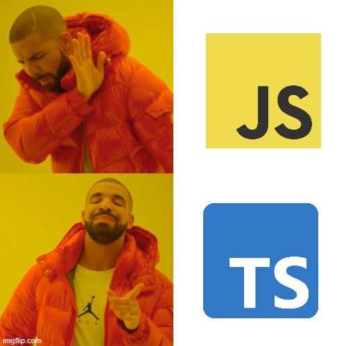

# FLISOL

Este repo forma parte de la presentación del evento online de [FLISOL 2024 en Cuba](https://flisol.dev/) que tuvo lugar el Sábado 27 de abril de 2024

## jsPDF

`jsPDF` es una biblioteca de Javascript para la generación de PDFs, funciona perfectamente con Angular, React, Vue y cualquier otro framework de Javascript.

## Enlaces útiles

- [Repositorio de `jsPDF` en Github](https://github.com/parallax/jsPDF)
- [Documentación Legacy de `jsPDF`](https://artskydj.github.io/jsPDF/docs/)
- [Documentación de `jsPDF`](https://raw.githack.com/MrRio/jsPDF/master/docs/index.html)
- [Componente de Angular para visualizar PDFs `ng2-pdf-viewer`](https://github.com/VadimDez/ng2-pdf-viewer/blob/master/README.md#usage)

## Nota

El proyecto en particular usa Angular como framework para mostrar algunas de las features básicas de jsPDF, es un proyecto orientado para principiantes y orientado para familiarizarse con la biblioteca.
Siquieres puedes contribuir con tu PR 😃

## La presentación

## Instalación
Pues te descargas el repo, abres la carpeta que te descargaste y corres `npm install` , luego le das `ng serve` y ya está
